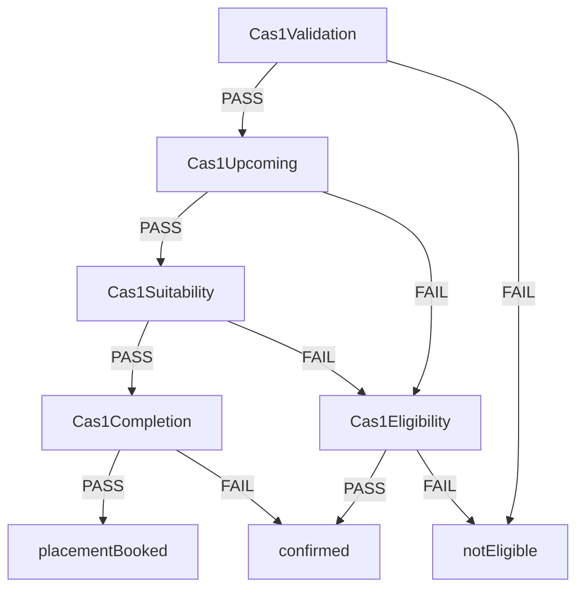
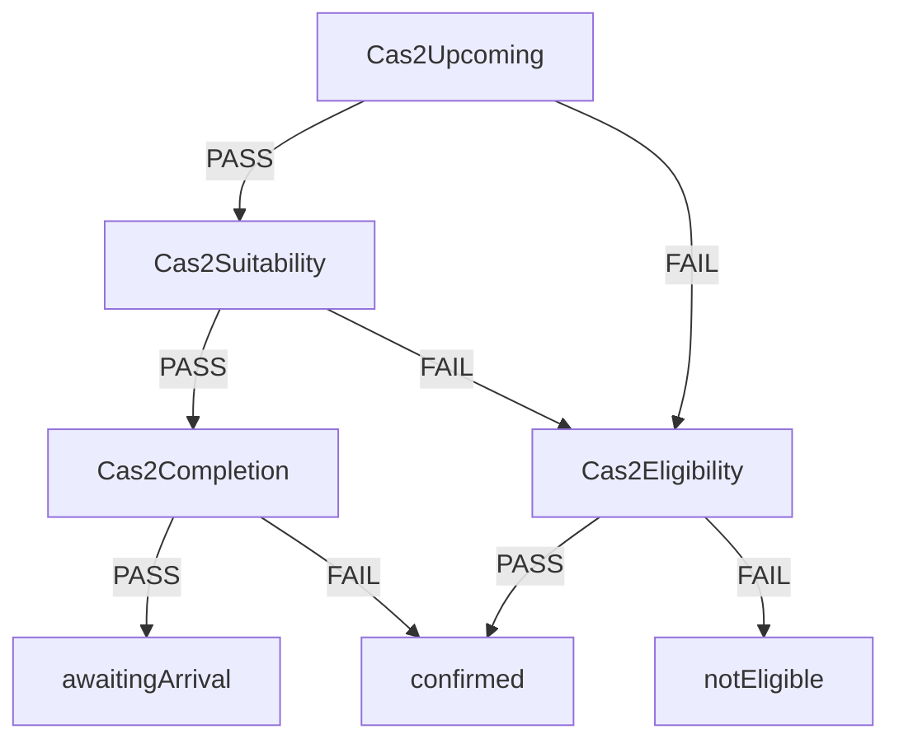
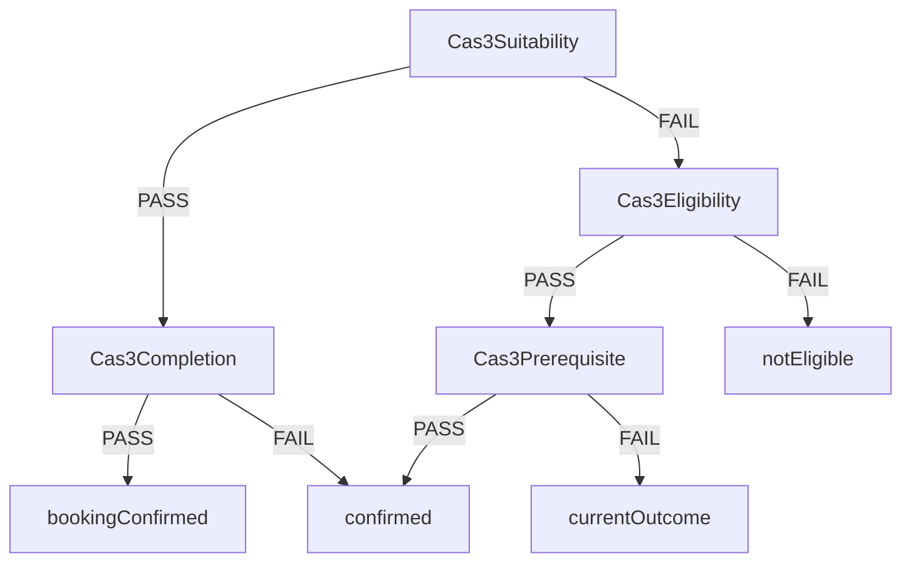
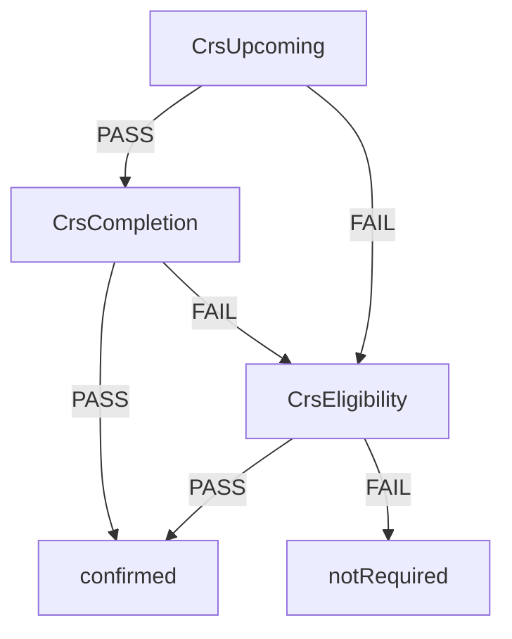
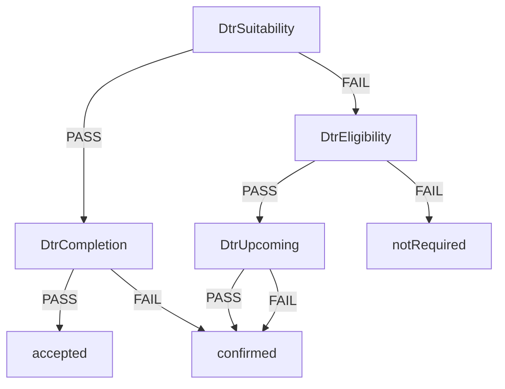
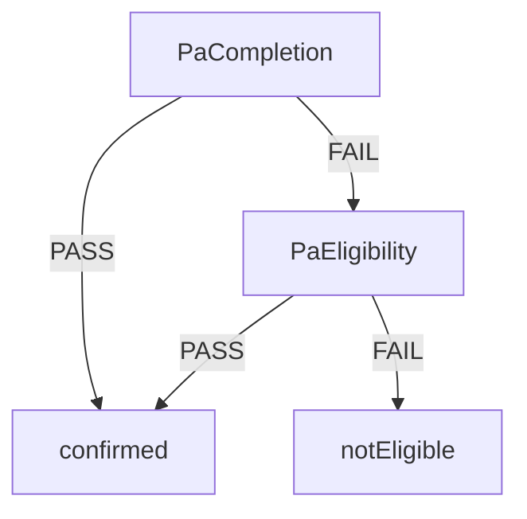

# Eligibility rules graph

Generated by `./gradlew :query:generateEligibilityRulesGraph`. Do not edit by hand.

## CAS1

### Nodes

**Cas1Validation** (RuleSet)
- `Cas1SexValidationRule`: FAIL if candidate has no sex

**Cas1Upcoming** (RuleSet)
- `ReleaseWithinOneYearRule`: FAIL if not within 1 year of release from current accommodation

**Cas1Suitability** (RuleSet)
- `Cas1ApplicationPresentRule`: FAIL if candidate does not have an application
- `Cas1ApplicationRelevantExpiredRule`: FAIL if expired application is not upcoming or arrived
- `Cas1ApplicationSuitabilityRule`: FAIL if candidate does not have a suitable application

**Cas1Completion** (RuleSet)
- `Cas1ApplicationCompletionRule`: FAIL if placement is not upcoming

**placementBooked** (Outcome)

**confirmed** (Outcome)

**Cas1Eligibility** (RuleSet)
- `STierEligibilityRule`: FAIL if candidate is S Tier
- `MaleRiskEligibilityRule`: FAIL if candidate is Male and is not Tier A3 - B1
- `NonMaleRiskEligibilityRule`: FAIL if candidate is not Male and is not Tier A3 - C3

**notEligible** (Outcome)

## CAS2

### Nodes

**Cas2Upcoming** (RuleSet)
- `ReleaseWithinOneYearRule`: FAIL if not within 1 year of release from current accommodation

**Cas2Suitability** (RuleSet)
- `Cas2ApplicationSubmittedRule`: FAIL if candidate does not have a submitted application
- `Cas2SuitableStatusRule`: FAIL if candidate has an unsuitable status

**Cas2Completion** (RuleSet)
- `Cas2ApplicationAwaitingArrivalRule`: FAIL if application is not awaiting arrival

**awaitingArrival** (Outcome)

**confirmed** (Outcome)

**Cas2Eligibility** (RuleSet)
- (no rules — always PASS)

**notEligible** (Outcome)

## CAS3

### Nodes

**Cas3Suitability** (RuleSet)
- `Cas3ApplicationSuitabilityRule`: FAIL if CAS3 application is not suitable
- `Cas3ApplicationPresentSuitabilityRule`: FAIL if CAS3 application is not present
- `Cas3BookingSuitabilityRule`: FAIL if booking is arrived, departed or closed
- `Cas3AssessmentSuitabilityRule`: FAIL if CAS3 assessment is rejected or closed

**Cas3Completion** (RuleSet)
- `Cas3ApplicationCompletionRule`: FAIL if CAS3 application is not complete

**bookingConfirmed** (Outcome)

**confirmed** (Outcome)

**Cas3Eligibility** (RuleSet)
- `CurrentAccommodationTypeRule`: FAIL if current accommodation is not Approved Premise (CAS1), CAS2, or Prison
- `NoNextAccommodationRule`: FAIL if candidate has next accommodation

**Cas3Prerequisite** (RuleSet)
- `DtrExpiredReferralRule`: FAIL if DTR is submitted more than 26 weeks ago.
- `CrsSubmittedRuleMale`: FAIL if CRS not submitted and male
- `CrsSubmittedRuleNonMale`: FAIL if CRS not submitted and not male

**currentOutcome** (Outcome)

**notEligible** (Outcome)

## CRS

### Nodes

**CrsUpcoming** (RuleSet)
- `CrsUpcomingRule`: FAIL if not within 12 weeks of release from current accommodation

**CrsCompletion** (RuleSet)
- `CrsSubmittedRule`: FAIL if no live CRS referral

**confirmed** (Outcome)

**CrsEligibility** (RuleSet)
- `NoNextAccommodationRule`: FAIL if candidate has next accommodation
- `IsSettledRule`: FAIL if candidate is settled

**notRequired** (Outcome)

## DTR

### Nodes

**DtrSuitability** (RuleSet)
- `DtrPresentRule`: FAIL if DTR status is not present
- `DtrNotWithdrawnRule`: FAIL if DTR referral has been withdrawn
- `DtrExpiredReferralRule`: FAIL if DTR is submitted more than 26 weeks ago.

**DtrCompletion** (RuleSet)
- `DtrApplicationCompleteRule`: FAIL if DTR not accepted

**accepted** (Outcome)

**confirmed** (Outcome)

**DtrEligibility** (RuleSet)
- `NoNextAccommodationRule`: FAIL if candidate has next accommodation

**DtrUpcoming** (RuleSet)
- `ReleaseWithinEightWeeksRule`: FAIL if not within 8 weeks of release from current accommodation

**notRequired** (Outcome)

## PA

### Nodes

**PaCompletion** (RuleSet)
- `HasNextAccommodationRule`: FAIL if candidate has no next accommodation

**confirmed** (Outcome)

**PaEligibility** (RuleSet)
- `Cas1ApplicationNotSuitableRule`: FAIL if candidate has a suitable CAS1 application
- `Cas3ApplicationNotSuitableRule`: FAIL if candidate has suitable CAS3 application

**notEligible** (Outcome)

## Rule catalogue

| Rule | Description | RuleSets | Trees |
| --- | --- | --- | --- |
| Cas1ApplicationCompletionRule | FAIL if placement is not upcoming | Cas1Completion | CAS1 |
| Cas1ApplicationNotSuitableRule | FAIL if candidate has a suitable CAS1 application | PaEligibility | PA |
| Cas1ApplicationPresentRule | FAIL if candidate does not have an application | Cas1Suitability | CAS1 |
| Cas1ApplicationRelevantExpiredRule | FAIL if expired application is not upcoming or arrived | Cas1Suitability | CAS1 |
| Cas1ApplicationSuitabilityRule | FAIL if candidate does not have a suitable application | Cas1Suitability | CAS1 |
| Cas1SexValidationRule | FAIL if candidate has no sex | Cas1Validation | CAS1 |
| Cas2ApplicationAwaitingArrivalRule | FAIL if application is not awaiting arrival | Cas2Completion | CAS2 |
| Cas2ApplicationSubmittedRule | FAIL if candidate does not have a submitted application | Cas2Suitability | CAS2 |
| Cas2SuitableStatusRule | FAIL if candidate has an unsuitable status | Cas2Suitability | CAS2 |
| Cas3ApplicationCompletionRule | FAIL if CAS3 application is not complete | Cas3Completion | CAS3 |
| Cas3ApplicationNotSuitableRule | FAIL if candidate has suitable CAS3 application | PaEligibility | PA |
| Cas3ApplicationPresentSuitabilityRule | FAIL if CAS3 application is not present | Cas3Suitability | CAS3 |
| Cas3ApplicationSuitabilityRule | FAIL if CAS3 application is not suitable | Cas3Suitability | CAS3 |
| Cas3AssessmentSuitabilityRule | FAIL if CAS3 assessment is rejected or closed | Cas3Suitability | CAS3 |
| Cas3BookingSuitabilityRule | FAIL if booking is arrived, departed or closed | Cas3Suitability | CAS3 |
| CrsSubmittedRule | FAIL if no live CRS referral | CrsCompletion | CRS |
| CrsSubmittedRuleMale | FAIL if CRS not submitted and male | Cas3Prerequisite | CAS3 |
| CrsSubmittedRuleNonMale | FAIL if CRS not submitted and not male | Cas3Prerequisite | CAS3 |
| CrsUpcomingRule | FAIL if not within 12 weeks of release from current accommodation | CrsUpcoming | CRS |
| CurrentAccommodationTypeRule | FAIL if current accommodation is not Approved Premise (CAS1), CAS2, or Prison | Cas3Eligibility | CAS3 |
| DtrApplicationCompleteRule | FAIL if DTR not accepted | DtrCompletion | DTR |
| DtrExpiredReferralRule | FAIL if DTR is submitted more than 26 weeks ago. | Cas3Prerequisite, DtrSuitability | CAS3, DTR |
| DtrNotWithdrawnRule | FAIL if DTR referral has been withdrawn | DtrSuitability | DTR |
| DtrPresentRule | FAIL if DTR status is not present | DtrSuitability | DTR |
| HasNextAccommodationRule | FAIL if candidate has no next accommodation | PaCompletion | PA |
| IsSettledRule | FAIL if candidate is settled | CrsEligibility | CRS |
| MaleRiskEligibilityRule | FAIL if candidate is Male and is not Tier A3 - B1 | Cas1Eligibility | CAS1 |
| NoNextAccommodationRule | FAIL if candidate has next accommodation | Cas3Eligibility, CrsEligibility, DtrEligibility | CAS3, CRS, DTR |
| NonMaleRiskEligibilityRule | FAIL if candidate is not Male and is not Tier A3 - C3 | Cas1Eligibility | CAS1 |
| ReleaseWithinEightWeeksRule | FAIL if not within 8 weeks of release from current accommodation | DtrUpcoming | DTR |
| ReleaseWithinOneYearRule | FAIL if not within 1 year of release from current accommodation | Cas1Upcoming, Cas2Upcoming | CAS1, CAS2 |
| STierEligibilityRule | FAIL if candidate is S Tier | Cas1Eligibility | CAS1 |

